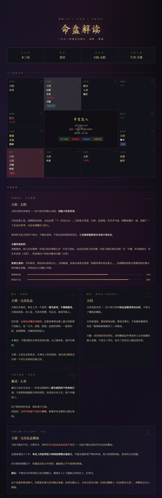

# 命理解读师.skill



> *「Elon Musk 的命盘示例」*

[](LICENSE)
[](https://agentskills.io)
[](https://python.org)
[](https://github.com/spyfree/iztro-py)

**输入生辰信息，生成一张精美的紫微斗数可视化命盘解读报告。**

融合紫微三合派、中州派和手相互证的方法论。Python 精确排盘，AI 生成有温度的解读，HTML 暗色星空主题可视化输出。

[效果示例](#效果示例) · [安装](#安装) · [使用](#使用) · [工作原理](#工作原理) · [仓库结构](#仓库结构)

---

## 效果示例

输入生辰信息后，命理解读师自动排盘并生成可视化命盘。以马斯克的命盘为例：

> **「天机太阴坐命寅宫——这个组合的核心词是：用脑子改变世界。」**
>
> 天机是谋士星，思维极活跃，永远在想「下一步怎么办」。太阴是月亮星，内省、直觉强。两颗星叠在一起，造就了一个永远在思考、永远在推翻自己的人。
>
> 寅宫的天机太阴有个特点：不满足现状。不是在现有框架里优化，是直接质疑框架本身该不该存在。

不仅是生辰解读，每张命盘都包含：

- **命盘底色** — 先天禀赋与性格核心
- **事业财运** — 官禄宫 + 财帛宫格局
- **感情婚姻** — 夫妻宫缘分模式
- **当前大限** — 此阶段核心课题
- **手相互证** — 掌纹与命盘交叉比对（可选）

**[查看完整示例命盘 →](https://github.com/learnwithu/mingli-master/blob/main/assets/musk-mingpan.jpg)**

---

## 安装

命理解读师基于开放的 [Agent Skills](https://agentskills.io) 协议，可在任何 skills-compatible 的 AI agent runtime 中运行。

### 前置依赖

命理解读师使用 [iztro-py](https://github.com/spyfree/iztro-py) 进行精确排盘计算，避免 LLM 排盘错误。使用前需要安装：

```bash
python3 -m pip install iztro-py --user --break-system-packages
```

### 方式一：一行命令（推荐，跨 runtime）

打开你正在用的 agent（Claude Code、Codex、Cursor 等），告诉它：

```
帮我安装这个 skill：https://github.com/learnwithu/mingli-master
```

或者用通用 CLI 安装器（[vercel-labs/skills](https://github.com/vercel-labs/skills)）：

```bash
npx skills add learnwithu/mingli-master
```

### 方式二：手动安装

| Runtime | 安装路径 |
|---------|---------|
| Claude Code | `~/.claude/skills/mingli-master/` |
| Codex CLI | `~/.codex/skills/mingli-master/` |
| Cursor | `~/.cursor/skills/mingli-master/` |

```bash
git clone https://github.com/learnwithu/mingli-master ~/.claude/skills/mingli-master/
```

### 方式三：作为 Prompt 使用

即使 runtime 不支持 Agent Skills 自动加载，也可以直接把 `SKILL.md` 的内容粘贴进对话——它本质就是一份 markdown + YAML frontmatter。

---

## 使用

装好后，直接用自然语言告诉 agent：

```
帮我排个命盘，1991年8月15日，丑时，男
算算我的事业和财运
看看我今年的运势
这是我的掌纹照片，帮我交叉比对一下
```

---

## 工作原理

输入生辰信息后，命理解读师做四件事：

**1. 精确排盘** — `calculate_chart.py` 调用 iztro-py 精确计算十二宫星曜分布、四化飞星、大限排布。用 Python 而非 LLM 来算数学，确保排盘 100% 准确。

**2. LLM 解读** — 根据排盘结果，参照十四主星、六吉六煞解读参考和四化飞星规则，生成有温度、有主见、用大白话翻译的解读文字。风格参考 `references/interpretation_guide.md`。

**3. 手相互证**（可选） — 如果用户提供了手相照片或文字描述，提取掌纹特征，与命盘交叉比对，标注吻合/矛盾之处。

**4. HTML 可视化** — 将排盘数据和解读文字填入固定模板，生成暗色星空主题的可视化命盘。

---

## 仓库结构

```
mingli-master/
├── SKILL.md                          # 命理解读师本体
├── README.md                         # 本文件
├── scripts/
│   ├── calculate_chart.py            # 排盘计算脚本（基于 iztro-py）
│   └── generate_html.py              # HTML 命盘生成脚本
├── templates/
│   └── chart_template.html           # 命盘 HTML 模板（暗色星空主题）
├── references/
│   ├── interpretation_guide.md       # 解读风格指南
│   ├── stars_reference.md            # 十四主星 + 六吉六煞参考
│   └── four_hua_reference.md         # 四化飞星参考
└── assets/
    └── musk-mingpan.jpg               # 示例命盘截图
```

---

## 为什么不用 LLM 直接算？

LLM 排盘会犯错。紫微斗数排盘涉及：

- 安命宫（根据生月 + 生时）
- 定五行局（根据命宫地支 + 生年天干）
- 安十四主星（根据五行局 + 生日）
- 四化飞星（根据生年天干）

这些全是精确的数学运算。LLM 靠"记忆"来算，换个生辰就可能算错（比如五行局写错、禄权顺序反了）。Python 脚本保证每次排盘 100% 一致且正确。

---

## 关于作者

**Bob（李波/波哥）** — AI 企业落地顾问，「与你同学 Learn With You」主理人

| 平台 | 链接 |
|------|------|
| 🎵 抖音 | 搜「与你同学 learn with you」（抖音号：learnwithyou） |
| 📕 小红书 | 搜「与你同学 learn with you」（小红书号：learnwithyou） |
| ✖️ X (Twitter) | [@learnwithyou_](https://x.com/learnwithyou_) |
| 📱 视频号 | 搜「与你同学 learnwithyou」 |
| 💬 公众号 | 微信搜「与你同学 learnwithyou」 |

---

## 致谢

- [iztro](https://github.com/SylarLong/iztro) — 紫微斗数排盘 JavaScript 库（3648+ stars）
- [iztro-py](https://github.com/spyfree/iztro-py) — 纯 Python iztro 实现

---

## 许可证

MIT — 随便用，随便改。

---

*「算命是对话，不是表演。准确度随沟通趋近。」*
